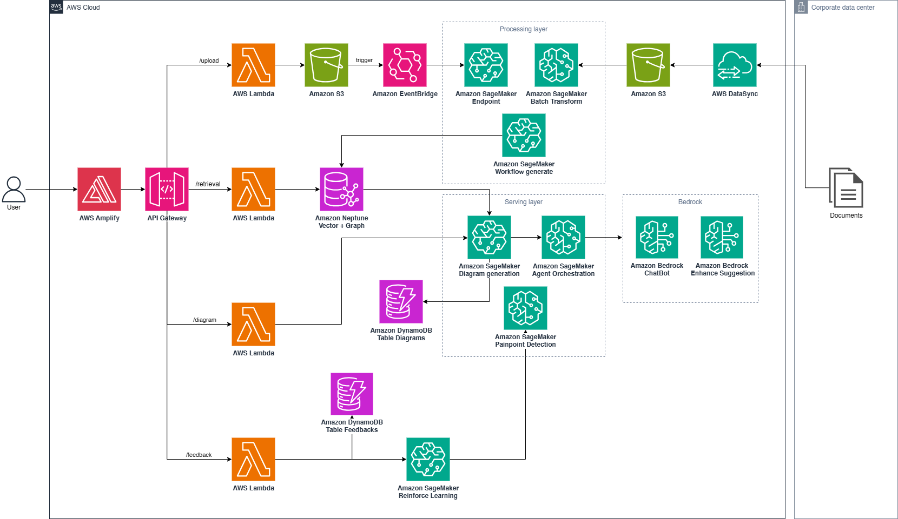
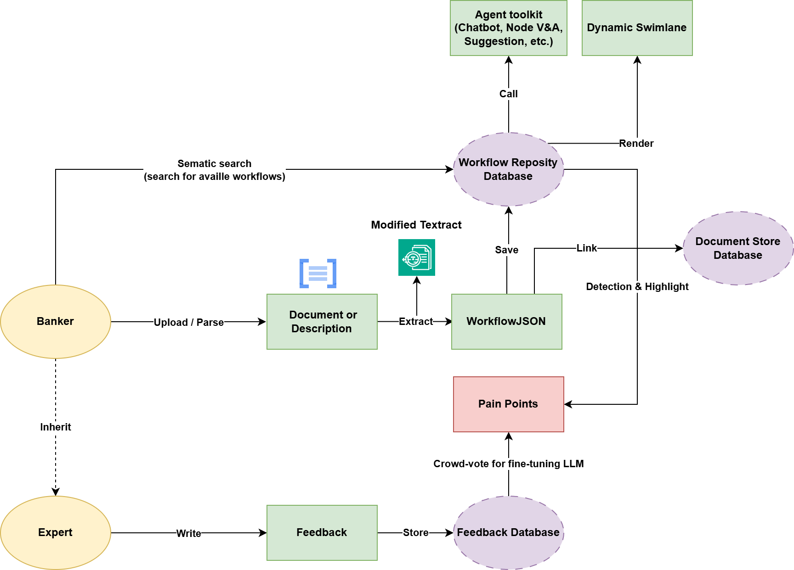

# VPFlow

VPFlow is a project developed by the SoftAI Team to streamline and automate business process management in Banking using advanced AI and workflow technologies.

## Overview

VPFlow provides a flexible platform for designing, executing, and monitoring business processes. It leverages modern web technologies and AI to help organizations optimize their workflows, improve efficiency, and gain actionable insights.

## Features

- **AI-Powered Workflow Automation**: Intelligent process optimization using machine learning
- **Business Process Management**: Design, execute, and monitor complex workflows
- **Banking Integration**: Specialized tools for financial process automation
- **Real-time Analytics**: Gain actionable insights from workflow data
- **Modern Web Interface**: User-friendly dashboard for process management
- **Scalable Architecture**: Built to handle enterprise-level workloads

## Tech Stack

- **Sagemaker**: Python, FastAPI
- **Frontend**: ReactJS, MaterialUI (Google)
- **Database**: AWS RDS PostgreSQL, DynamoDB
- **AI/ML**: AWS Bedrock, Sagemaker,...
- **Deployment**: Docker, Kubernetes

## VPBank Architecture Project

### System Architecture (AWS Cloud)


### Workflow Concept


## Getting Started

### Prerequisites

- Python 3.8+
- Node.js 16+
- Git


## Configuration

Create a `.env` file in the root directory with the following variables:

```env
DATABASE_URL=your_database_url
API_KEY=your_api_key
DEBUG=true
```

## Contributing

1. Fork the repository
2. Create a feature branch (`git checkout -b feature/AmazingFeature`)
3. Commit your changes (`git commit -m 'Add some AmazingFeature'`)
4. Push to the branch (`git push origin feature/AmazingFeature`)
5. Open a Pull Request

## API Documentation

API documentation is available at `http://localhost:8000/docs` when running the development server.

## Support

For support, please contact the SoftAI Team or create an issue in this repository.

## License

This project is licensed under the MIT License - see the [LICENSE](LICENSE) file for details.

---

**Developed by the SoftAI Team** 🚀
